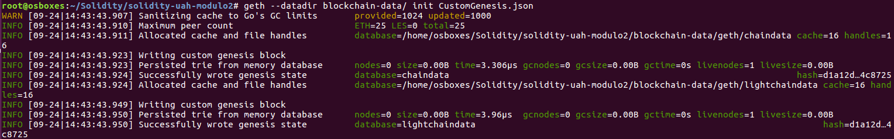
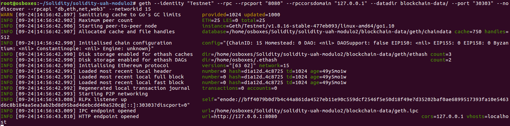
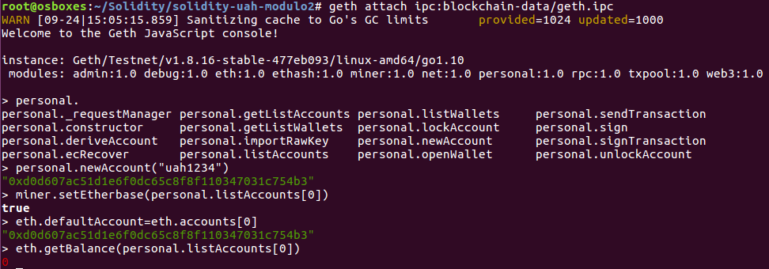
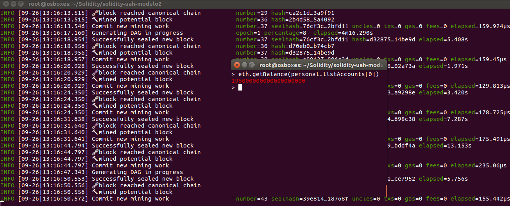
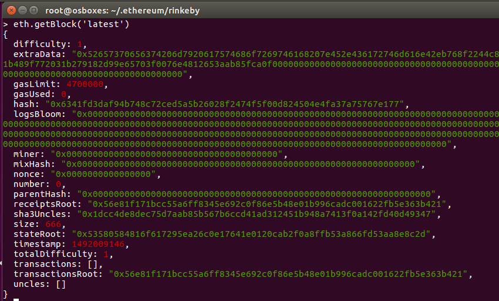
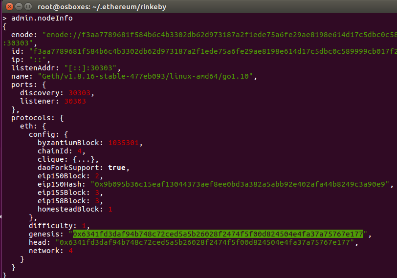
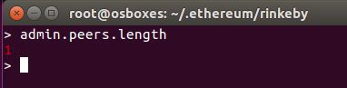
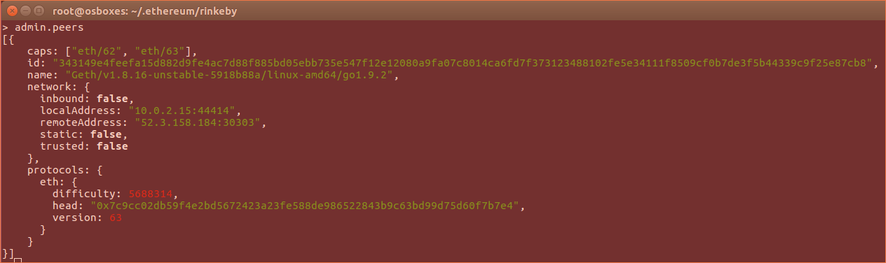

## solidity-uah-modulo2

### **Actividad 1** - Blockchian propia con Génesis.

El fichero Genesis que se ha utilizado es: [CustomGenesis.json](CustomGenesis.json)

Se ejecuta el comando `geth init` para inicializar la Blockchain indicando la ruta donde se quiere guardar los datos de la misma y el fichero de configuración de Génesis a utilizar:

Se ejecuta la Blockchain por primera vez  utilizando el comando `geth`:

A continuación, hacemos un `get attach` a la Blockchain para conectarnos por IPC. Una vez conectados a la consola de JavaScript de Geth, ya podemos crear una cuenta en la Blockchain y ver su balance:

Como se observa en la imagen, el balance de la cuenta es 0.

Se va a minar durante 2 minutos con el comando `miner.start(2)`:

En la imagen se muestra como se están minando los bloques. Además, el balance la cuenta ya tiene Ethers.

### **Actividad 2** - Red Rinkeby

Se ha utilizado el comando `geth --rinkeby` para sincronizar con la red Rinkeby.

Se obtiene el bloque génesis desde la consola utilizando el comando `eth.getBlock('latest')`:

Además, si no se quiere utilizar el comando `eth.getBlock`, se puede usar `admin.nodeInfo`:

Address de Genesis: `0x6341fd3daf94b748c72ced5a5b26028f2474f5f00d824504e4fa37a75767e177`

Para visualizar el numero de peers a los que se está conectado se usa el comando `admin.peers.length`. También se puede usar el comano `net.peerCount`:

Y para obtener más detalles de los peers conectados se usa `admin.peers`:

La altura máxima de bloque la vemos con el atributo `head`.

### **Actividad 3** - 

### Autor
- Javier Gasso

