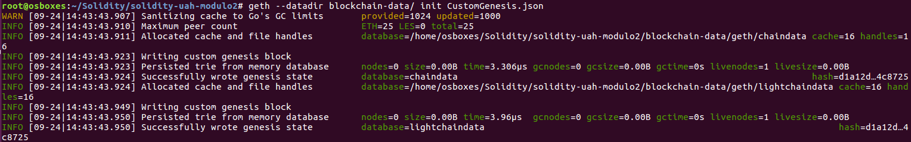
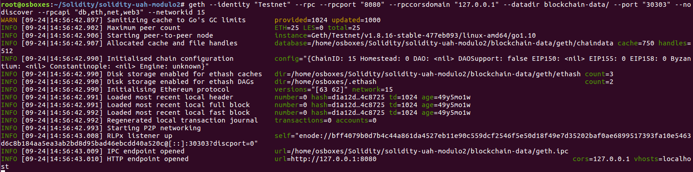
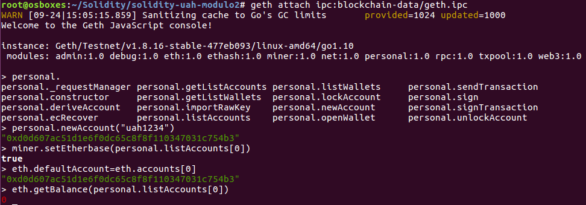
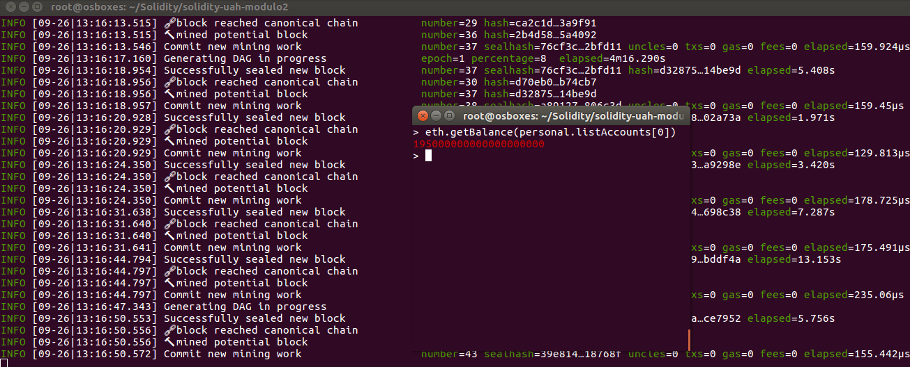

## solidity-uah-modulo2

### **Actividad 1** - Blockchian propia con Génesis.

El fichero Genesis que se ha utilizado es: [CustomGenesis.json](CustomGenesis.json)

Se ejecuta el comando `geth init` para inicializar la Blockchain indicando la ruta donde se quiere guardar los datos de la misma y el fichero de configuración de Génesis a utilizar:

Se ejecuta la Blockchain por primera vez  utilizando el comando `geth`:

A continuación, hacemos un `get attach` a la Blockchain para conectarnos por IPC. Una vez conectados a la consola de JavaScript de Geth, ya podemos crear una cuenta en la Blockchain y ver su balance:

Como se observa en la imagen, el balance de la cuenta es 0.

Se va a minar durante 2 minutos con el comando `miner.start(2)`:

En la imagen se muestra como se están minando los bloques. Además, el balance la cuenta ya tiene Ethers.

### Autor
- Javier Gasso
