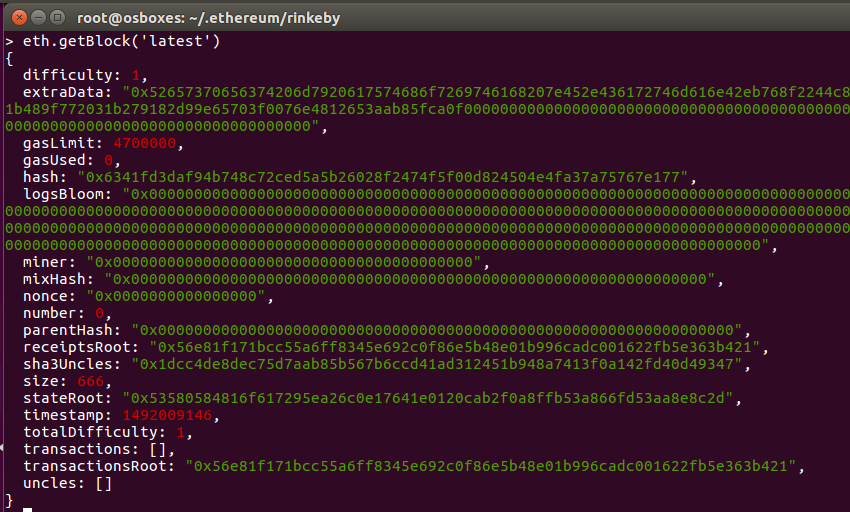
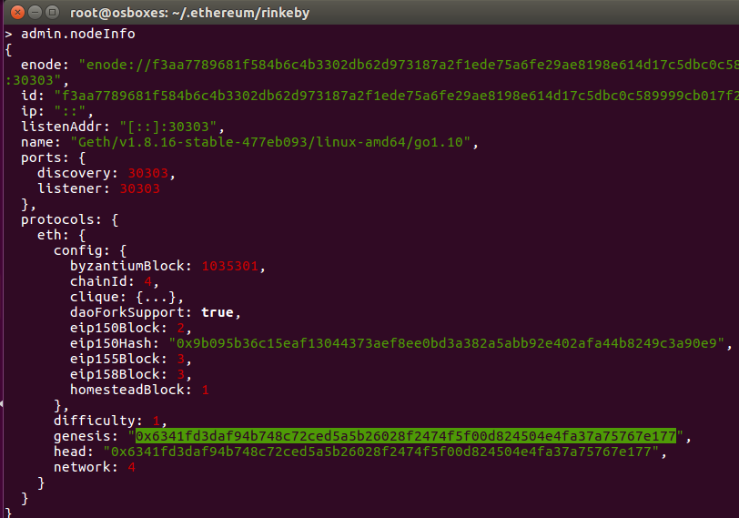
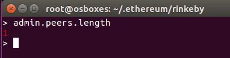
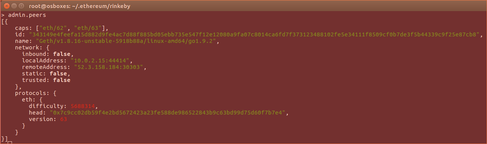

## solidity-uah-modulo2

### **Actividad 2** - Red Rinkeby

Se ha utilizado el comando `geth --rinkeby` para sincronizar con la red Rinkeby.

Se obtiene el bloque génesis desde la consola utilizando el comando `eth.getBlock('latest')`:

Además, si no se quiere utilizar el comando `eth.getBlock`, se puede usar `admin.nodeInfo`:

Address de Genesis: `0x6341fd3daf94b748c72ced5a5b26028f2474f5f00d824504e4fa37a75767e177`

Para visualizar el numero de peers a los que se está conectado se usa el comando `admin.peers.length`. También se puede usar el comano `net.peerCount`:

Y para obtener más detalles de los peers conectados se usa `admin.peers`:

La altura máxima de bloque la vemos con el atributo `head`.

### Autor
- Javier Gasso
