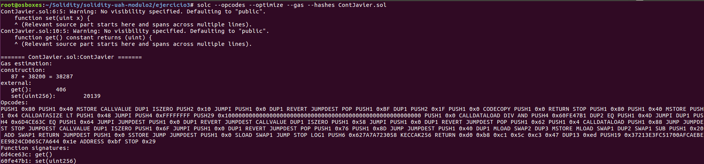

## solidity-uah-modulo2

### **Actividad 3** - Compilador solc

Una vez instalado `solc` como se indica en la guía de instalación, se crea el contrato [ContJavier.sol](ContJavier.sol)

A continuación, se ejecuta el siguiente comando para obtener la información solicitada:

### Autor
- Javier Gasso